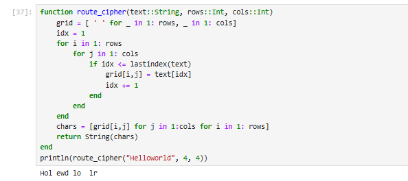
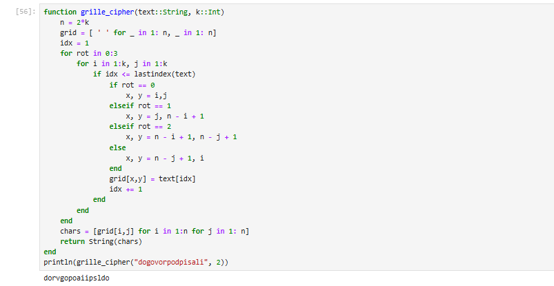
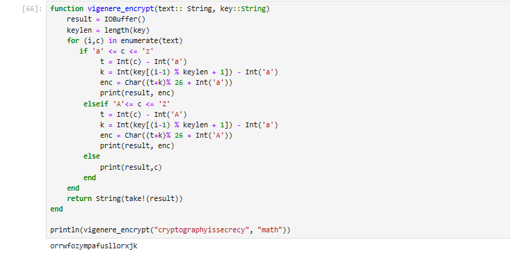

---
## Front matter
title: "Лабораторная работа №2"
subtitle: "Шифры перестановки"
author: "Лебедева Ольга Андреевна"

## Generic otions
lang: ru-RU
toc-title: "Содержание"

## Bibliography
bibliography: bib/cite.bib
csl: pandoc/csl/gost-r-7-0-5-2008-numeric.csl

## Pdf output format
toc: true # Table of contents
toc-depth: 2
lof: true # List of figures
#lot: true # List of tables
fontsize: 12pt
linestretch: 1.5
papersize: a4
documentclass: scrreprt
## I18n polyglossia
polyglossia-lang:
  name: russian
  options:
    - spelling=modern
    - babelshorthands=true
polyglossia-otherlangs:
  name: english
## I18n babel
babel-lang: russian
babel-otherlangs: english
## Fonts
mainfont: "Times New Roman"
romanfont: "Times New Roman"
sansfont: "Arial"
monofont: "Consolas"
mainfontoptions: Ligatures=TeX
romanfontoptions: Ligatures=TeX
sansfontoptions: Ligatures=TeX,Scale=MatchLowercase
monofontoptions: Scale=MatchLowercase,Scale=0.9
## Biblatex
biblatex: true
biblio-style: "gost-numeric"
biblatexoptions:
  - parentracker=true
  - backend=biber
  - hyperref=auto
  - language=auto
  - autolang=other*
  - citestyle=gost-numeric
## Pandoc-crossref LaTeX customization
figureTitle: "Рис."
tableTitle: "Таблица"
listingTitle: "Листинг"
lofTitle: "Список иллюстраций"
lotTitle: "Список таблиц"
lolTitle: "Листинги"
## Misc options
indent: true
header-includes:
  - \usepackage{indentfirst}
  - \usepackage{float} # keep figures where there are in the text
  - \floatplacement{figure}{H} # keep figures where there are in the text
---

# Цель работы

Изучить и реализовать на языке Julia[1] методы символьного шифрования на примере Маршрутного шифра[2], Решётчатого шифра[3] и шифра Виженера[4].

# Задачи

1. Ознакомиться с принципами построения маршрутного и решётчатого шифров.
2. Реализовать классический шифр Виженера.
3. Освоить работу с двумерными матрицами и символьными строками в Julia.
4. Провести тестирование алгоритмов.

# Объект и предмет исследования

Объект исследования: классические методы шифрования текста.

Предмет исследования: алгоритмы маршрутного, решетчатого и шифра Виженера, их реализация средствами Julia.

# Условные обозначения и термины

Маршрутный шифр — метод шифрования, при котором текст вписывается в таблицу построчно, а затем считывается по определённому маршруту (например, по столбцам).

Решётчатый шифр — метод шифрования, при котором символы записываются через «маску-решётку», которая поворачивается на 90° и позволяет постепенно заполнить всю таблицу.

Шифр Виженера — полиалфавитный шифр, использующий ключевое слово для последовательного смещения символов текста.

# Техническое оснащение и выбранные методы проведения работы

Программное обеспечение:

- Язык программирования Julia.
- Среда разработки JupyterLab / VS Code.

Методы:

- Формирование двумерных массивов символов.
- Использование арифметики по модулю для циклического сдвига символов. 
- Работа с символьными данными в циклах

# Теоретическое введение

Все три метода относятся к классическим подстановочным или маршрутным шифрам:

- Маршрутный шифр демонстрирует важность выбора порядка считывания данных из матрицы.

- Решётчатый шифр основан на повороте ключевой «маски», что позволяет равномерно распределять текст.

- Шифр Виженера является развитием идеи шифра Цезаря: он использует несколько алфавитов, задаваемых ключевым словом, что делает криптоанализ более сложным.

# Задание

1. Реализовать все три шифра из задания лабораторной работы №2.

# Маршрутный шифр

Выполним задание 1 с помощью языка Julia: 

    function route_cipher(text::String, rows::Int, cols::Int)
        grid = [ ' ' for _ in 1: rows, _ in 1: cols]
        idx = 1
        for i in 1: rows
            for j in 1: cols
                if idx <= lastindex(text)
                    grid[i,j] = text[idx]
                    idx += 1
                end
            end
        end
        chars = [grid[i,j] for j in 1:cols for i in 1: rows]
        return String(chars)
    end
    println(route_cipher("Helloworld", 4, 4))

Проверим результат работы кода: См. [рис. 1](#fig:001)

{ #fig:001 width=70% }

Данный алгоритм является простейшей формой маршрутного шифрования. Он работает по принципу "запись по строкам - чтение по столбцам". Сначала исходный текст построчно записывается в таблицу заданного размера (rows × cols). Если текст короче общего размера таблицы, оставшиеся ячейки заполняются пробелами. 

Ключевыми параметрами шифра являются размеры таблицы (количество строк и столбцов). Для расшифровки получатель должен знать эти параметры, чтобы восстановить исходную таблицу и прочитать сообщение в правильном порядке - по строкам.

# Шифр с помощью решётки

Выполним задание 2 с помощью языка Julia: 

    function grille_cipher(text::String, k::Int)
        n = 2*k
        grid = [ ' ' for _ in 1: n, _ in 1: n]
        idx = 1
        for rot in 0:3
            for i in 1:k, j in 1:k
                if idx <= lastindex(text)
                    if rot == 0
                        x, y = i,j
                    elseif rot == 1
                        x, y = j, n - i + 1
                    elseif rot == 2
                        x, y = n - i + 1, n - j + 1
                    else
                        x, y = n - j + 1, i
                    end
                    grid[x,y] = text[idx]
                    idx += 1
                end
            end
        end
        chars = [grid[i,j] for i in 1:n for j in 1: n]
        return String(chars)
    end
    println(grille_cipher("dogovorpodpisali", 2))      

Проверим результат работы кода: См. [рис. 2](#fig:002)

{ #fig:002 width=70% }

Данный алгоритм использует принцип механической решетки с отверстиями для шифрования. Ключом является параметр k, определяющий размер квадратной таблицы (n × n, где n = 2k) и расположение "отверстий" - в данном случае это все ячейки меньшего квадрата k × k в левом верхнем углу. Процесс шифрования состоит из четырех этапов, соответствующих поворотам решетки на 0°, 90°, 180° и 270°.

На каждом этапе символы исходного текста последовательно записываются в те ячейки таблицы, которые оказываются под отверстиями решетки в текущем положении. После записи каждой порции символов решетка поворачивается на 90 градусов по часовой стрелке, что позволяет равномерно распределить текст по всей таблице. После четырех поворотов таблица полностью заполняется, а шифртекст образуется путем построчного чтения всех ячеек.

Для расшифровки получатель должен иметь решетку с идентичными отверстиями и, зная значение k, повторить ту же последовательность поворотов, но уже читая символы из соответствующих позиций.

# Таблица Виженера

Выполним задание 3 с помощью языка Julia: 

    function vigenere_encrypt(text:: String, key::String)
        result = IOBuffer()
        keylen = length(key)
        for (i,c) in enumerate(text)
        if 'a' <= c <= 'z'
                t = Int(c) - Int('a')
                k = Int(key[(i-1) % keylen + 1]) - Int('a')
                enc = Char((t+k)% 26 + Int('a'))
                print(result, enc)
            elseif 'A'<= c <= 'Z'
                t = Int(c) - Int('A')
                k = Int(key[(i-1) % keylen + 1]) - Int('a')
                enc = Char((t+k)% 26 + Int('A'))
                print(result, enc)
            else 
                print(result,c)
            end
        end
        return String(take!(result))
    end

    println(vigenere_encrypt("cryptographyissecrecy", "math"))   

Проверим результат работы кода: См. [рис. 3](#fig:003)

{ #fig:003 width=70% }

Шифр Виженера является полиалфавитным шифром, что означает использование разных алфавитов для шифрования различных символов исходного текста. Основой алгоритма служит ключевое слово, которое циклически повторяется для сопоставления с каждой буквой шифруемого сообщения. Процесс шифрования заключается в применении операции сложения по модулю 26 к числовым значениям символов текста и ключа.

Для каждой буквы исходного текста определяется соответствующая буква ключа (с циклическим повторением), затем вычисляется сдвиг в алфавите как сумма позиций буквы текста и буквы ключа. Полученный результат по модулю 26 дает позицию зашифрованного символа. Алгоритм сохраняет регистр символов: строчные буквы шифруются в строчные, прописные - в прописные, а не-буквенные символы остаются без изменений.

Данный метод обеспечивает высокую криптостойкость по сравнению с моноалфавитными шифрами, поскольку одна и та же буква исходного текста может быть зашифрована разными способами в зависимости от своей позиции в сообщении. Для расшифровки требуется точное ключевое слово, чтобы выполнить обратную операцию вычитания по модулю 26.

# Полученные результаты

1. Реализованы функции для маршрутного шифра, решётчатого шифра и шифра Виженера.

2. Проверена корректность работы алгоритмов на тестовых строках.

# Заключение

В работе были изучены три различных метода шифрования. Получены навыки работы с двумерными таблицами и полиалфавитными шифрами. Практика показала, что даже простые алгоритмы могут эффективно изменять структуру текста, делая его нечитаемым без ключа.

# Библиографическая справка 

[1] Julia: https://ru.wikipedia.org/wiki/Julia

[2] Маршрутное шифрование: https://ru.wikipedia.org/wiki/%D0%9F%D0%B5%D1%80%D0%B5%D1%81%D1%82%D0%B0%D0%BD%D0%BE%D0%B2%D0%BE%D1%87%D0%BD%D1%8B%D0%B9_%D1%88%D0%B8%D1%84%D1%80

[3] Шифрование с помощью решетки: https://ru.wikipedia.org/wiki/%D0%A8%D0%B8%D1%84%D1%80%D0%BE%D0%B2%D0%B0%D0%BB%D1%8C%D0%BD%D0%B0%D1%8F_%D1%80%D0%B5%D1%88%D1%91%D1%82%D0%BA%D0%B0

[4] Таблица Виженера: https://ru.wikipedia.org/wiki/%D0%A8%D0%B8%D1%84%D1%80_%D0%92%D0%B8%D0%B6%D0%B5%D0%BD%D0%B5%D1%80%D0%B0