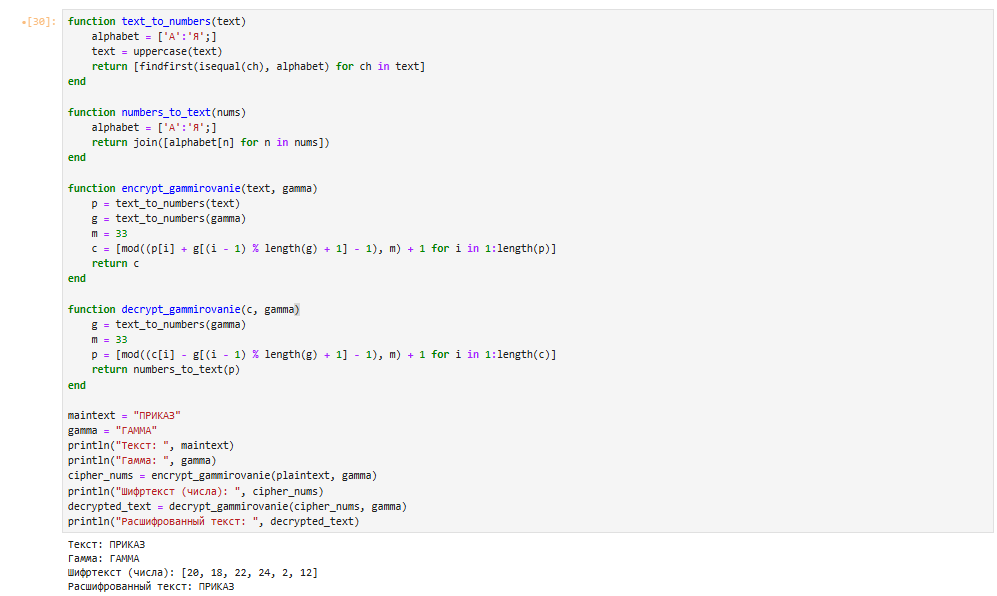

---
## Front matter
title: "Лабораторная работа №3"
subtitle: "Шифрование гаммированием"
author: "Лебедева Ольга Андреевна"

## Generic otions
lang: ru-RU
toc-title: "Содержание"

## Bibliography
bibliography: bib/cite.bib
csl: pandoc/csl/gost-r-7-0-5-2008-numeric.csl

## Pdf output format
toc: true # Table of contents
toc-depth: 2
lof: true # List of figures
#lot: true # List of tables
fontsize: 12pt
linestretch: 1.5
papersize: a4
documentclass: scrreprt
## I18n polyglossia
polyglossia-lang:
  name: russian
  options:
    - spelling=modern
    - babelshorthands=true
polyglossia-otherlangs:
  name: english
## I18n babel
babel-lang: russian
babel-otherlangs: english
## Fonts
mainfont: "Times New Roman"
romanfont: "Times New Roman"
sansfont: "Arial"
monofont: "Consolas"
mainfontoptions: Ligatures=TeX
romanfontoptions: Ligatures=TeX
sansfontoptions: Ligatures=TeX,Scale=MatchLowercase
monofontoptions: Scale=MatchLowercase,Scale=0.9
## Biblatex
biblatex: true
biblio-style: "gost-numeric"
biblatexoptions:
  - parentracker=true
  - backend=biber
  - hyperref=auto
  - language=auto
  - autolang=other*
  - citestyle=gost-numeric
## Pandoc-crossref LaTeX customization
figureTitle: "Рис."
tableTitle: "Таблица"
listingTitle: "Листинг"
lofTitle: "Список иллюстраций"
lotTitle: "Список таблиц"
lolTitle: "Листинги"
## Misc options
indent: true
header-includes:
  - \usepackage{indentfirst}
  - \usepackage{float} # keep figures where there are in the text
  - \floatplacement{figure}{H} # keep figures where there are in the text
---

# Цель работы

Изучить и реализовать на языке Julia[1] метод симметричного шифрования гаммированием[2] с использованием операции сложения по модулю.

# Задачи

1. Ознакомиться с принципом работы метода гаммирования.
2. Реализовать алгоритм шифрования и дешифрования на языке Julia.
3. Провести тестирование алгоритма.

# Объект и предмет исследования

Объект исследования: симметричный метод шифрования гаммированием.

Предмет исследования: алгоритм шифрования гаммированием, его реализация средствами Julia.

# Условные обозначения и термины

Шифрование гаммированием — это метод симметричного шифрования, при котором каждый символ открытого текста складывается по модулю с символом ключевой последовательности (гаммы).

Гамма — псевдослучайная последовательность чисел или символов, используемая для наложения на исходный текст.

Модуль — число, определяющее диапазон возможных значений результата арифметической операции. В данной работе используется модуль 33, соответствующий количеству букв русского алфавита.

Ключ — исходное значение (фраза или набор чисел), из которого строится гамма и с помощью которого выполняется как шифрование, так и дешифрование.

# Техническое оснащение и выбранные методы проведения работы

Программное обеспечение:

- Язык программирования Julia.
- Среда разработки JupyterLab / VS Code.

Методы:

- Использование арифметики по модулю для операций над элементами алфавита.
- Преобразование текста в числовые последовательности и обратно.
- Работа с символьными строками и циклами в Julia.
- Реализация повторяющейся гаммы при шифровании длинных сообщений.

# Теоретическое введение

Метод гаммирования относится к симметричным криптографическим методам.  
Каждый символ открытого текста представляется числом по таблице алфавита и складывается с соответствующим числом гаммы по модулю мощности алфавита.  

ci = (pi + gi − 1) mod 33 + 1  
pi = (ci − gi − 1) mod 33 + 1  

где  

pi — код i-го символа исходного текста,  
gi — код i-го символа гаммы,  
ci — код i-го символа шифртекста.  

Если длина гаммы меньше длины текста, гамма повторяется циклически.  
Метод симметричен: операция шифрования и расшифрования описывается одинаковой формулой с противоположным знаком.

# Задание

1. Реализовать алгоритм шифрования гаммированием на русском алфавите.
2. Написать функции преобразования текста в числовую форму и обратно.
3. Реализовать операции шифрования и расшифрования по приведённым формулам.
4. Проверить корректность работы программы на примере:

# Шифрование гаммированием

Выполним задание с помощью языка Julia: 

    function text_to_numbers(text)
        alphabet = ['А':'Я';]
        text = uppercase(text)
        return [findfirst(isequal(ch), alphabet) for ch in text]
    end

    function numbers_to_text(nums)
        alphabet = ['А':'Я';]
        return join([alphabet[n] for n in nums])
    end

    function encrypt_gammirovanie(text, gamma)
        p = text_to_numbers(text)
        g = text_to_numbers(gamma)
        m = 33
        c = [mod((p[i] + g[(i - 1) % length(g) + 1] - 1), m) + 1 for i in 1:length(p)]
        return c
    end

    function decrypt_gammirovanie(c, gamma)
        g = text_to_numbers(gamma)
        m = 33
        p = [mod((c[i] - g[(i - 1) % length(g) + 1] - 1), m) + 1 for i in 1:length(c)]
        return numbers_to_text(p)
    end

    maintext = "ПРИКАЗ"
    gamma = "ГАММА"
    println("Текст: ", maintext)
    println("Гамма: ", gamma)
    cipher_nums = encrypt_gammirovanie(plaintext, gamma)
    println("Шифртекст (числа): ", cipher_nums)
    decrypted_text = decrypt_gammirovanie(cipher_nums, gamma)
    println("Расшифрованный текст: ", decrypted_text)

Проверим результат работы кода: См. [рис. 1](#fig:001)

{ #fig:001 width=70% }

Принцип работы программы
1. Функция text_to_numbers преобразует буквы русского алфавита в числа от 1 до 33. 
2. Функция numbers_to_text выполняет обратное преобразование - восстанавливает техт из чисел. 
3. Функция encrypt_gammirovanie складывает значения текста и гаммы по модулю 33. Операция гарантирует, что намерация остается в пределах [1,33].
4. Функция decrypt_gammirovanie производит обратное вычитание по модулю 33. Здесь также используется -1 перед mod, чтобы компенсировать смещение, связанное с нумерацией от 1. 
5. После выполнения программы выводятся числовоей шифртекст и восстановленный исходный текст.

# Полученные результаты и заключение

Программа корректно реализует метод гаммирования на русском алфавите. При шифровании каждая буква заменяется суммой её позиции и позиции буквы гаммы по модулю. При расшифровке производится обратное вычитаение, что полностью восстанавливает исходый текст. Результаты совпадают с приведенным примером из методического пособия. 

# Библиографическая справка 

[1] Julia: https://ru.wikipedia.org/wiki/Julia

[2] Шифрование гаммированием: https://ru.wikipedia.org/wiki/%D0%93%D0%B0%D0%BC%D0%BC%D0%B8%D1%80%D0%BE%D0%B2%D0%B0%D0%BD%D0%B8%D0%B5

