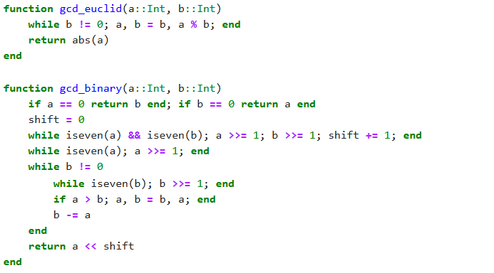
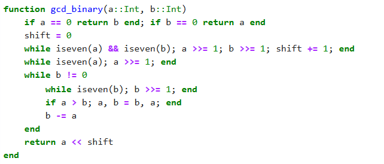
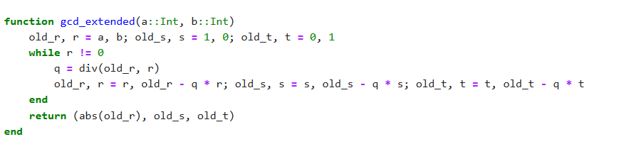
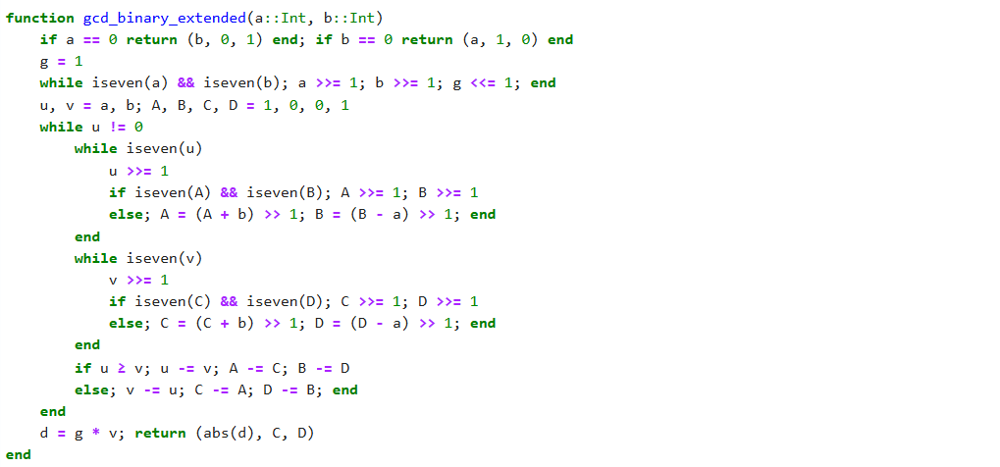
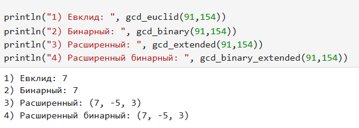

---
## Front matter
title: "Лабораторная работа №4"
subtitle: "Вычисление наибольшего общего делителя"
author: "Лебедева Ольга Андреевна"

## Generic otions
lang: ru-RU
toc-title: "Содержание"

## Bibliography
bibliography: bib/cite.bib
csl: pandoc/csl/gost-r-7-0-5-2008-numeric.csl

## Pdf output format
toc: true # Table of contents
toc-depth: 2
lof: true # List of figures
#lot: true # List of tables
fontsize: 12pt
linestretch: 1.5
papersize: a4
documentclass: scrreprt
## I18n polyglossia
polyglossia-lang:
  name: russian
  options:
    - spelling=modern
    - babelshorthands=true
polyglossia-otherlangs:
  name: english
## I18n babel
babel-lang: russian
babel-otherlangs: english
## Fonts
mainfont: "Times New Roman"
romanfont: "Times New Roman"
sansfont: "Arial"
monofont: "Consolas"
mainfontoptions: Ligatures=TeX
romanfontoptions: Ligatures=TeX
sansfontoptions: Ligatures=TeX,Scale=MatchLowercase
monofontoptions: Scale=MatchLowercase,Scale=0.9
## Biblatex
biblatex: true
biblio-style: "gost-numeric"
biblatexoptions:
  - parentracker=true
  - backend=biber
  - hyperref=auto
  - language=auto
  - autolang=other*
  - citestyle=gost-numeric
## Pandoc-crossref LaTeX customization
figureTitle: "Рис."
tableTitle: "Таблица"
listingTitle: "Листинг"
lofTitle: "Список иллюстраций"
lotTitle: "Список таблиц"
lolTitle: "Листинги"
## Misc options
indent: true
header-includes:
  - \usepackage{indentfirst}
  - \usepackage{float} # keep figures where there are in the text
  - \floatplacement{figure}{H} # keep figures where there are in the text
---

# Цель работы

Изучить и реализовать на языке Julia[1] классический[2], бинарный, расширенный[3] и бинарный расширенный алгоритмы Евклида для нахождения наибольшего общего делителя.

# Задачи

1. Реализовать четыре варианта алгоритма Евклида на языке Julia.

# Объект и предмет исследования

Объект исследования: алгоритмы вычисления НОД.

Предмет исследования: классический, бинарный, расширенный и бинарный расширенный алгоритмы Евклида.

# Условные обозначения и термины

НОД (наибольший общий делитель) — наибольшее целое число, на которое делятся оба числа без остатка.

Коэффициенты линейной комбинации (x, y) — числа, удовлетворяющие уравнению
a·x + b·y = НОД(a, b).

Бинарный алгоритм — вариант метода Евклида, использующий деление на 2 вместо деления с остатком.

Расширенный алгоритм — модификация метода Евклида, позволяющая вычислить не только НОД, но и коэффициенты x и y.

# Техническое оснащение и выбранные методы проведения работы

Программное обеспечение:

- Язык программирования Julia.
- Среда разработки JupyterLab / VS Code.

Методы:

- Использование циклов и целочисленного деления.
- Работа с арифметическими операциями по модулю.
- Побитовые операции для бинарного алгоритма.
- Реализация шагов расширенного алгоритма с сохранением коэффициентов x и y.

# Теоретическое введение

Метод Евклида является классическим способом нахождения наибольшего общего делителя двух целых чисел.
Он основан на свойстве:

    если a = b·q + r, то НОД(a, b) = НОД(b, r)
Алгоритм повторяется, пока остаток не станет равен нулю.

Бинарный алгоритм Евклида оптимизирует вычисления, заменяя деление на операции вычитания и деления на 2 (битовые сдвиги), что ускоряет выполнение на компьютере.

Расширенный алгоритм Евклида помимо НОД находит коэффициенты x и y, при которых выполняется равенство 

    a·x + b·y = НОД(a, b)

Эти коэффициенты широко применяются в криптографии и теории чисел.

Расширенный бинарный алгоритм Евклида объединяет оба подхода, повышая эффективность вычислений при сохранении возможности нахождения коэффициентов.

# Задание

1. Реализовать четыре алгоритма Евклида на языке Julia.
2. Проверить работу программ.
3. Вывести результаты (НОД и коэффициенты).

# Реализация алгоритмов. Классический Евклид

Напишем код 1 с помощью языка Julia: См. [рис. 1](#fig:001)

{ #fig:001 width=70% }

Классический алгоритм Евклида основан на свойстве:
если a = b·q + r, где r — остаток от деления, то НОД(a, b) = НОД(b, r).
Это означает, что общий делитель двух чисел не изменится, если большее число заменить на остаток от деления его на меньшее.

В программе используется цикл while, который выполняется до тех пор, пока второе число не станет равным нулю.
На каждом шаге происходит операция: 

    a, b = b, a % b 

то есть старшее число заменяется младшим, а младшее — остатком от деления.
Когда остаток становится равным нулю, переменная a содержит значение наибольшего общего делителя.
Алгоритм является базовым, надёжным и демонстрирует принцип постепенного уменьшения пары чисел до их общего делителя.

# Реализация алгоритмов. Бинарный Евклид

Напишем код 2 с помощью языка Julia: См. [рис. 2](#fig:002)

{ #fig:002 width=70% }

Бинарный (или двоичный) алгоритм Евклида является оптимизированной версией классического метода.
Он основан на том, что деление на 2 можно заменить побитовым сдвигом, что существенно ускоряет вычисления на уровне машинных операций.

Программа проверяет чётность чисел с помощью функции iseven().
Если оба числа чётные — они делятся на 2, а общий множитель 2 запоминается.
Если одно из чисел чётное, оно делится на 2, пока не станет нечётным.
Если оба числа нечётные, из большего вычитается меньшее — при этом НОД не меняется.
Цикл продолжается до тех пор, пока одно из чисел не обнулится.
В конце результат восстанавливается умножением на сохранённую степень двойки.
Таким образом, алгоритм избегает операций деления с остатком и использует только побитовые сдвиги и вычитания.

# Реализация алгоритмов. Расширенный Евклид

Напишем код 3 с помощью языка Julia: См. [рис. 3](#fig:003)

{ #fig:003 width=70% }

Расширенный алгоритм Евклида не только находит НОД, но и вычисляет такие коэффициенты x и y, для которых выполняется равенство:

    a·x + b·y = НОД(a, b)

Алгоритм использует те же шаги, что и классический, но дополнительно сохраняет линейные комбинации исходных чисел.
На каждом шаге, кроме вычисления остатка, пересчитываются коэффициенты s и t, которые отражают, как текущий остаток выражается через a и b.

Когда один из остатков становится равным нулю, предыдущие значения s и t содержат коэффициенты, удовлетворяющие приведённому уравнению.
Эти значения часто применяются в криптографии (например, при поиске обратных элементов по модулю).
В итоге алгоритм возвращает три значения: сам НОД и коэффициенты x, y.

# Реализация алгоритмов. Бинарный расширенный Евклид

Напишем код 4 с помощью языка Julia: См. [рис. 4](#fig:004)

{ #fig:004 width=70% }

Расширенный бинарный алгоритм Евклида объединяет идеи двух предыдущих методов:
он выполняет операции над числами с использованием только сдвигов и вычитаний, но при этом вычисляет коэффициенты x и y в выражении:

    a·x + b·y = НОД(a, b)

Алгоритм начинается с удаления общих множителей 2, которые накапливаются в переменной g.
Далее формируются две пары коэффициентов (A, B) и (C, D), которые позволяют отслеживать, как каждое текущее число u и v выражается через исходные a и b.
На каждом шаге алгоритм делает одно из чисел нечётным, затем вычитает меньшее из большего, корректируя коэффициенты, чтобы сохранить равенство.

Когда одно из чисел становится нулём, второе содержит значение НОД, а соответствующие коэффициенты (x, y) — решение линейной комбинации.
Благодаря бинарной оптимизации этот метод работает быстрее, чем классический расширенный вариант, особенно для больших чисел.

# Полученные результаты и заключение

Запустим код и проверим результаты работы алгоритмов: См. [рис. 5](#fig:005)

{ #fig:005 width=70% }

В ходе работы были изучены и реализованы четыре варианта алгоритма Евклида.
Все методы дают одинаковый результат по величине НОД, что подтверждает их корректность.
Бинарные алгоритмы демонстрируют более высокую эффективность при работе с большими числами, так как используют операции побитового сдвига.
Расширенные версии позволяют получить дополнительные параметры (коэффициенты линейной комбинации), применяемые в криптографии.

# Библиографическая справка 

[1] Julia: https://ru.wikipedia.org/wiki/Julia

[2] Алгоритм Евклида — https://ru.wikipedia.org/wiki/Алгоритм_Евклида

[3] Расширенный алгоритм Евклида — https://ru.wikipedia.org/wiki/Расширенный_алгоритм_Евклида

