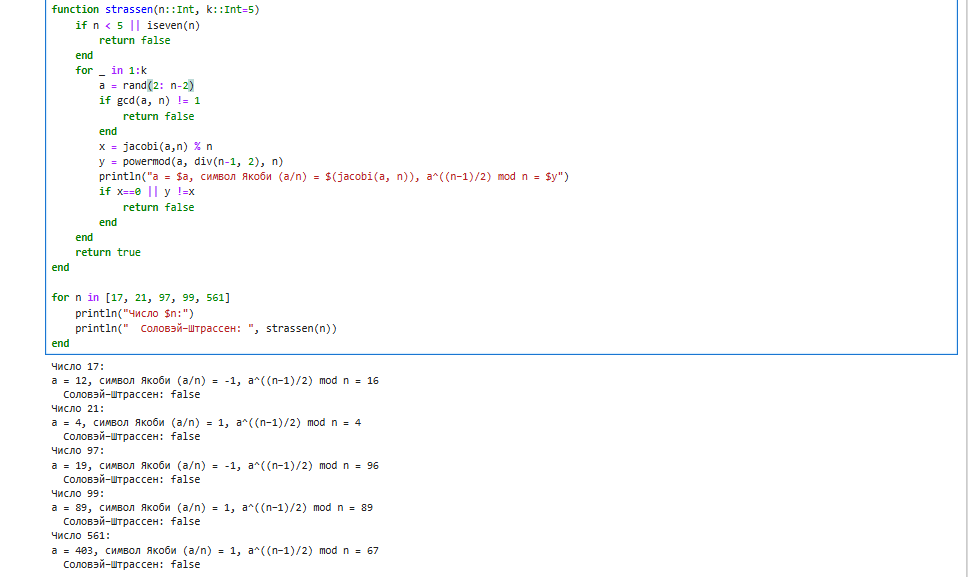

---
## Front matter
title: "Лабораторная работа №5"
subtitle: "Вероятностные алгоритмы проверки чисел на простоту"
author: "Лебедева Ольга Андреевна"

## Generic otions
lang: ru-RU
toc-title: "Содержание"

## Bibliography
bibliography: bib/cite.bib
csl: pandoc/csl/gost-r-7-0-5-2008-numeric.csl

## Pdf output format
toc: true # Table of contents
toc-depth: 2
lof: true # List of figures
#lot: true # List of tables
fontsize: 12pt
linestretch: 1.5
papersize: a4
documentclass: scrreprt
## I18n polyglossia
polyglossia-lang:
  name: russian
  options:
    - spelling=modern
    - babelshorthands=true
polyglossia-otherlangs:
  name: english
## I18n babel
babel-lang: russian
babel-otherlangs: english
## Fonts
mainfont: "Times New Roman"
romanfont: "Times New Roman"
sansfont: "Arial"
monofont: "Consolas"
mainfontoptions: Ligatures=TeX
romanfontoptions: Ligatures=TeX
sansfontoptions: Ligatures=TeX,Scale=MatchLowercase
monofontoptions: Scale=MatchLowercase,Scale=0.9
## Biblatex
biblatex: true
biblio-style: "gost-numeric"
biblatexoptions:
  - parentracker=true
  - backend=biber
  - hyperref=auto
  - language=auto
  - autolang=other*
  - citestyle=gost-numeric
## Pandoc-crossref LaTeX customization
tableTitle: "Таблица"
listingTitle: "Листинг"
lofTitle: "Список иллюстраций"
lotTitle: "Список таблиц"
lolTitle: "Листинги"
## Misc options
indent: true
header-includes:
  - \usepackage{indentfirst}
  - \usepackage{float} # keep figures where there are in the text
  - \floatplacement{figure}{H} # keep figures where there are in the text
---

# Цель работы

Изучить и реализовать на языке Julia[1] вероятностные методы проверки простоты чисел: тест Ферма[2], тест Соловэя-Штрассена[3], тест Миллера-Рабина[4] и вычисления символа Якоби[5].

# Задачи

1. Ознакомиться с теоретическими основами вероятностных тестов на простоту.

2. Реализовать и протестировать алгоритмы Ферма, Соловея–Штрассена и Миллера–Рабина.

3. Изучить вычисление символа Якоби как вспомогательной функции для теста Соловея–Штрассена.

4. Сравнить точность и поведение различных тестов на примерах простых и составных чисел.

# Объект и предмет исследования

Объект исследования: методы проверки чисел на простоту.

Предмет исследования: вероятностные алгоритмы, основанные на свойствах чисел в модульной арифметике.

# Условные обозначения и термины

Простое число – натуральное число больше единицы, имеющее ровно два различных натуральных делителя: 1 и само себя.

Составное число – натуральное число, имеющее более двух делителей.

Модульная арифметика – система вычислений по модулю n, в которой рассматриваются остатки от деления чисел на n.

Вероятностный тест на простоту – алгоритм, который на основе случайно выбираемых параметров определяет, является ли число вероятно простым или точно составным; допускает малую вероятность ошибки в сторону "простое" для некоторых составных чисел.

Символ Якоби (a/n) – обобщение символа Лежандра для нечётного положительного n. Принимает значения -1, 0 или 1 и используется для анализа квадратичных вычетов и в вероятностных тестах на простоту.

Основание теста (a) – целое число, выбираемое в заданном диапазоне (обычно от 2 до n-2), используемое в формулах проверок.

powermod(a, b, n) – возведение числа a в степень b по модулю n с использованием быстрого алгоритма (используется для эффективности и предотвращения переполнения).

# Техническое оснащение и выбранные методы проведения работы

Программное обеспечение:

- Язык программирования Julia.
- Среда разработки JupyterLab / VS Code.

Методы:

- Использование модульной арифметики для возведения в степень по модулю.
- Генерация случайных оснований для тестов.
- Проверка выполнения сравнений в модульной системе.
- Многократное повторение тестов для снижения вероятности ошибки.

# Теоретическое введение

Проверка чисел на простоту является важной задачей теории чисел и криптографии. Детерминированные методы, такие как деление на все возможные делители до sqrt(n) требуют слишком больших вычислений для больших чисел. Поэтому в практических системах используются вероятностные тесты, которые позволяют быстро определить, является ли число вероятно простым.

Среди таких тестов выделяются три наиболее известных метода: тест Ферма, тест Соловэя–Штрассена и тест Миллера–Рабина. Они основаны на свойствах чисел в модульной арифметике и используют случайные основания для проверки выполнения определённых сравнений. Ошибка возможна, но вероятность её возникновения стремительно уменьшается с увеличением числа итераций.

Символ Якоби, в свою очередь, является важным элементом при реализации теста Соловэя–Штрассена, поскольку он позволяет связать поведение степени числа с теоретическими свойствами квадратичных вычетов.

# Задание

Реализовать на Julia четыре функции:

1. Тест Ферма.
2. Вычисление символа Якоби.
3. Тест Соловэя–Штрассена.
4. Тест Миллера–Рабина.

# Тест Ферма

Выполним задание 1 с помощью языка Julia: 

Проверим результат работы кода: См. [рис. 1](#fig:001)

{ #fig:001 width=70% }

Алгоритм основан на малой теореме Ферма, согласно которой, если число $p$ простое, то для любого целого $a$, взаимно простого с $p$, выполняется соотношение
$a^{p-1} \equiv 1 \pmod p$.

Проверка заключается в выборе нескольких случайных оснований $a$ из диапазона $2 \le a \le n - 2$ и вычислении значения $a^{n-1} \bmod n$.
Если равенство выполняется для всех выбранных оснований, число считается вероятно простым.
Метод обеспечивает простую и быструю проверку свойств числа в модульной арифметике, что делает его удобным для первичной оценки простоты.

# Вычисление символа Якоби

Выполним задание 2 с помощью языка Julia и проверим результат работы кода: См. [рис. 2](#fig:002)

{ #fig:002 width=70% }

Символ Якоби $(a/n)$ представляет собой обобщение символа Лежандра и используется для анализа свойств чисел в модульной арифметике.
Он принимает значения $1$, $-1$ или $0$ и вычисляется на основе ряда правил, включая выделение степеней числа 2 и закон квадратичной взаимности.

Значение символа Якоби позволяет установить связь между степенью числа и его квадратичными вычетами по модулю $n$.
В контексте проверки простоты символ Якоби служит важным элементом, применяемым в тесте Соловэя–Штрассена.

# Тест Соловэя–Штрассена

Выполним задание 3 с помощью языка Julia. 
Проверим результат работы кода: См. [рис. 3](#fig:003)

{ #fig:003 width=70% }

Тест Соловэя–Штрассена объединяет идею теста Ферма и использование символа Якоби для уточнения результатов.
Если число $n$ простое, то для любого $a$, взаимно простого с $n$, выполняется соотношение
$a^{(n-1)/2} \equiv \left(\dfrac{a}{n}\right) \pmod n$.

Здесь $\left(\dfrac{a}{n}\right)$ — символ Якоби, вычисляемый по отдельному алгоритму.
В ходе проверки выбирается несколько случайных оснований $a$, для которых вычисляются обе части равенства.
Если они совпадают, число считается вероятно простым.
Метод позволяет уточнить оценку простоты числа и служит развитием идеи теста Ферма, опираясь на более глубокие свойства теории чисел.

# Тест Миллера–Рабина

Выполним задание 4 с помощью языка Julia.
Проверим результат работы кода: См. [рис. 4](#fig:004)

{ #fig:004 width=70% }

Тест Миллера–Рабина представляет собой один из наиболее надёжных вероятностных методов проверки простоты числа и применяется в криптографических системах.
Число $n - 1$ представляется в виде $n - 1 = 2^s \cdot d$, где $d$ — нечётное.
Для случайного основания $a$ проверяются условия:

$a^d \equiv 1 \pmod n$
или
$a^{2^r d} \equiv -1 \pmod n$ для некоторого $r < s$.

Если хотя бы одно из этих условий выполняется, число рассматривается как вероятно простое.
Тест повторяется несколько раз для разных оснований, что повышает достоверность результата.
Благодаря сочетанию эффективности и высокой вероятности правильного решения, метод Миллера–Рабина является практическим стандартом проверки простоты чисел.

# Полученные результаты

В ходе лабораторной работы были реализованы четыре алгоритма на языке Julia: тест Ферма, функция вычисления символа Якоби, тест Соловея–Штрассена и тест Миллера–Рабина.
Для проверки корректности работы были проведены эксперименты на различных типах чисел: простых (17, 97), составных (21, 99) и числе Кармайкла 561.

Результаты показали ожидаемое поведение всех алгоритмов:

- для простых чисел тесты Ферма, Соловея–Штрассена и Миллера–Рабина подтвердили их простоту;

- для составных чисел значения корректно определялись как составные;

- число 561, обладающее особыми свойствами, также корректно было классифицировано тестами Соловэя–Штрассена и Миллера–Рабина.

Таким образом, все реализованные функции отработали корректно, подтвердив как правильность кода, так и теоретические зависимости, заложенные в алгоритмы.

# Заключение

В результате выполнения лабораторной работы были изучены и реализованы вероятностные методы проверки чисел на простоту.
Алгоритмы Ферма, Соловэя–Штрассена и Миллера–Рабина были исследованы как с теоретической, так и с практической точки зрения.
Реализация на Julia позволила закрепить навыки работы с модульной арифметикой.

# Библиографическая справка 

[1] [Julia](https://ru.wikipedia.org/wiki/Julia)

[2] [Малая теорема Ферма](https://ru.wikipedia.org/wiki/%D0%9C%D0%B0%D0%BB%D0%B0%D1%8F_%D1%82%D0%B5%D0%BE%D1%80%D0%B5%D0%BC%D0%B0_%D0%A4%D0%B5%D1%80%D0%BC%D0%B0)

[3] [Тест Соловэя–Штрассена](https://ru.wikipedia.org/wiki/%D0%A2%D0%B5%D1%81%D1%82_%D0%A1%D0%BE%D0%BB%D0%BE%D0%B2%D0%B5%D1%8F_%E2%80%94_%D0%A8%D1%82%D1%80%D0%B0%D1%81%D1%81%D0%B5%D0%BD%D0%B0)

[4] [Тест Миллера–Рабина](https://ru.wikipedia.org/wiki/%D0%A2%D0%B5%D1%81%D1%82_%D0%9C%D0%B8%D0%BB%D0%BB%D0%B5%D1%80%D0%B0_%E2%80%94_%D0%A0%D0%B0%D0%B1%D0%B8%D0%BD%D0%B0)

[5] [Символ Якоби](https://ru.wikipedia.org/wiki/%D0%A1%D0%B8%D0%BC%D0%B2%D0%BE%D0%BB_%D0%AF%D0%BA%D0%BE%D0%B1%D0%B8)

