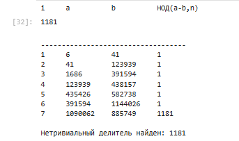
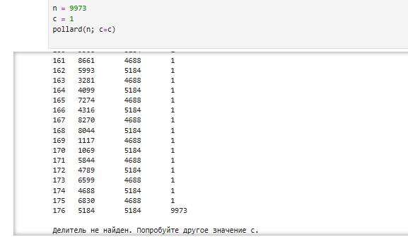

---
## Front matter
title: "Лабораторная работа №6"
subtitle: "Разложение чисел на множители"
author: "Лебедева Ольга Андреевна"

## Generic otions
lang: ru-RU
toc-title: "Содержание"

## Bibliography
bibliography: bib/cite.bib
csl: pandoc/csl/gost-r-7-0-5-2008-numeric.csl

## Pdf output format
toc: true # Table of contents
toc-depth: 2
lof: true # List of figures
#lot: true # List of tables
fontsize: 12pt
linestretch: 1.5
papersize: a4
documentclass: scrreprt
## I18n polyglossia
polyglossia-lang:
  name: russian
  options:
    - spelling=modern
    - babelshorthands=true
polyglossia-otherlangs:
  name: english
## I18n babel
babel-lang: russian
babel-otherlangs: english
## Fonts
mainfont: "Times New Roman"
romanfont: "Times New Roman"
sansfont: "Arial"
monofont: "Consolas"
mainfontoptions: Ligatures=TeX
romanfontoptions: Ligatures=TeX
sansfontoptions: Ligatures=TeX,Scale=MatchLowercase
monofontoptions: Scale=MatchLowercase,Scale=0.9
## Biblatex
biblatex: true
biblio-style: "gost-numeric"
biblatexoptions:
  - parentracker=true
  - backend=biber
  - hyperref=auto
  - language=auto
  - autolang=other*
  - citestyle=gost-numeric
## Pandoc-crossref LaTeX customization
tableTitle: "Таблица"
listingTitle: "Листинг"
lofTitle: "Список иллюстраций"
lotTitle: "Список таблиц"
lolTitle: "Листинги"
## Misc options
indent: true
header-includes:
  - \usepackage{indentfirst}
  - \usepackage{float} # keep figures where there are in the text
  - \floatplacement{figure}{H} # keep figures where there are in the text
---

# Цель работы

Изучить и реализовать на языке Julia[1] алгоритм разложения составных чисел на множители, в частности ρ-метод Полларда[2], а также посмотреть его эффективность на различных числах.

# Задачи

1. Ознакомиться с теоретическими основами задачи факторизации чисел.

2. Изучить идею ρ-метода Полларда.

3. Реализовать данный метод на языке Julia.

4. Проверить работу алгоритма на примера чисел различного типа.

5. Проанализировать результаты и сделать выводы о его применимости.

# Объект и предмет исследования

Объект исследования: алгоритм факторизации составных чисел.
Предмет исследования: вероятностные методы разложения чисел на множители, основанные на свойствах модульной арифметики.

# Условные обозначения и термины

**Факторизация (разложение на множители)** — представление составного числа \( n \) в виде произведения простых чисел.  

**НОД(a, b)** — наибольший общий делитель чисел a и b.  

**Модульная арифметика** — система вычислений, в которой операции производятся по остатку от деления на заданное число n.  

**ρ-метод Полларда** — стохастический (вероятностный) метод поиска нетривиальных делителей числа, использующий повторяющуюся последовательность в модульной арифметике и вычисление НОД разности элементов.

# Техническое оснащение и выбранные методы проведения работы

Программное обеспечение:

- Язык программирования Julia.
- Среда разработки JupyterLab / VS Code.

Методы:

- Использование функции f(x) = (x² + c) mod n.  
- Генерация последовательностей и вычисление НОД с числом n.  
- Анализ полученных итераций и контроль циклов.

# Теоретическое введение

Задача разложения числа на множители является фундаментальной для теории чисел и криптографии.  
От её сложности зависит безопасность криптосистем с открытым ключом (например, RSA), поскольку нахождение делителей большого числа, являющегося произведением двух простых, требует значительных вычислительных затрат.

**ρ-метод Полларда** (читается «ро-метод») — один из простейших и наиболее эффективных вероятностных алгоритмов факторизации.   Его идея основана на поиске цикла в последовательности, построенной по функции  f(x) = (x² + c) mod n. Если два элемента последовательности совпадают по модулю одного из делителей n, то разность между ними будет кратна этому делителю. Используя вычисление НОД, можно получить нетривиальный делитель числа n.

Метод назван ρ (ро) из-за формы траектории последовательности на графике — она напоминает греческую букву ρ. Главное преимущество алгоритма — высокая скорость нахождения делителя при малом объёме памяти.

# Задание

1. Реализовать p-метод Полларда в среде Julia.  
2. Протестировать программу на различных числах.  
3. Оформить результаты в табличном виде, аналогично примеру из методички.  

# ρ-метод Полларда

Выполним задание с помощью языка Julia: 

using Printf
using Random

    function pollard(n::Int; c::Int=1)
        f(x) = (x^2 + 5) % n
        a = c
        b = c
        d = 1
        i = 1
        println(@sprintf("%-5s %-10s %-10s %-10s", "i", "a", "b", "НОД(a-b,n)"))
        println("-"^35)
        while d == 1
            a = f(a)
            b = f(f(b))
            d = gcd(abs(a - b), n)
            println(@sprintf("%-5d %-10d %-10d %-10d", i, a, b, d))
            i += 1
        end
        if d == n
            println("\nДелитель не найден. Попробуйте другое значение c.")
            return nothing
        else
            println("\nНетривиальный делитель найден: $d")
            return d
        end
    end

    n = 1359331
    c = 1
    pollard(n; c=c)

Проверим результат работы кода для числа из методички 1359331. Как видно, уже на нескольких итерациях алгоритм находит нетривиальный делитель: См. [рис. 1](#fig:001)

{ #fig:001 width=70% }

Попробуем подставить другое число, 9973. Для него алгоритм Полларда не нашёл нетривиальных делителей, что подтверждает его простоту: См. [рис. 2](#fig:002)

{ #fig:002 width=70% }

Метод Полларда использует идею повторяющихся остатков в модульной арифметике.  
Когда последовательность \( f(x) \) начинает повторяться по одному из скрытых модулей (например, по p, если \( n = pq \)), два значения \( a \) и \( b \) становятся равны по модулю p, но различаются по модулю q.  
В этот момент разность \( |a - b| \) делится на p, а вычисление НОД выявляет этот делитель.

# Полученные результаты и заключение

В ходе лабораторной работы был изучен и реализован ρ-метод Полларда для разложения составных чисел на множители.  
Реализация на Julia позволила пронаблюдать процесс поиска делителя по шагам и убедиться в эффективности алгоритма.

Метод Полларда продемонстрировал свою простоту и надёжность при решении задач факторизации. Он особенно полезен при анализе чисел средней длины и может служить основой для более сложных алгоритмов факторизации, применяемых в криптографии.

# Библиографическая справка 

[1] [Julia](https://ru.wikipedia.org/wiki/Julia)

[2] [ρ-метод Полларда](https://ru.wikipedia.org/wiki/%D0%A0%D0%BE-%D0%B0%D0%BB%D0%B3%D0%BE%D1%80%D0%B8%D1%82%D0%BC_%D0%9F%D0%BE%D0%BB%D0%BB%D0%B0%D1%80%D0%B4%D0%B0)

