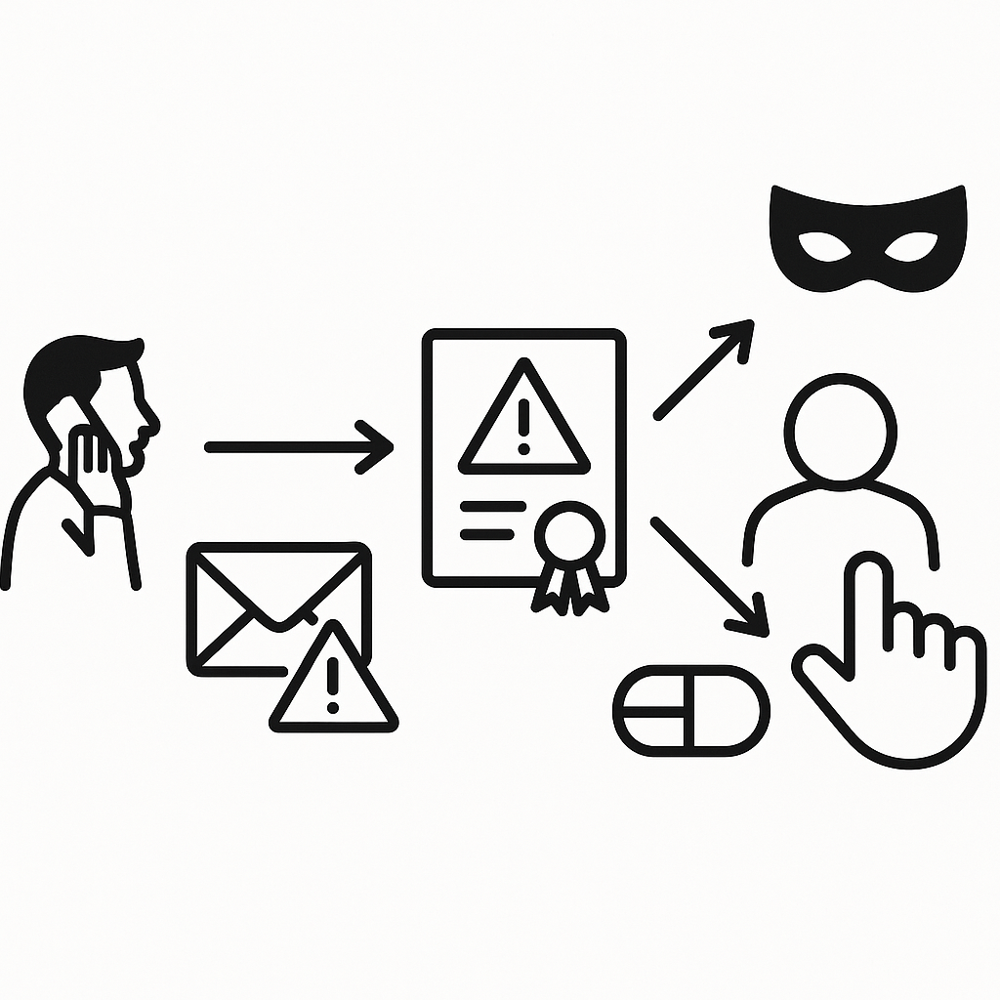

---
## Front matter
lang: ru-RU
title: "Доклад по теме: Атаки цифровой подписи" 
subtitle: 
author: |
        Выполнила: Лебедева Ольга Андреевна
        \
        Преподаватель Кулябов Дмитрий Сергеевич д.ф.-м.н.,
institute: |
           РУДН, Москва, Россия
date: |
      2025

babel-lang: russian
babel-otherlangs: english
mainfont: Arial
monofont: Courier New
fontsize: 8pt

## Formatting
toc: false
slide_level: 2
theme: Madrid
aspectratio: 43
section-titles: true
---

## Докладчик

:::::::::::::: {.columns align=center}
::: {.column width="70%"}

  * Лебедева Ольга Андреевна
  * Студентка группы НПМмд-02-25
  * РУДН

:::
::: {.column width="30%"}

:::
::::::::::::::

## Введение

Современные цифровые подписи [1] стали основой доверия в электронной среде — от банковских операций до государственных систем. Однако, как и любые криптографические механизмы, они уязвимы перед различными видами атак[2].

## Цели и задачи

Провести анализ основных видов атак на системы электронной цифровой подписи, классифицировать их по методам реализации и возможным последствиям.

1.	Дать определение ЭЦП и раскрыть ее ключевые функции.
2.	Изучить и систематизировать основные модели атак на ЭЦП, включая адаптивные атаки, атаки на основе коллизий хеш-функций и социальные атаки.
3.	Сформулировать выводы о наиболее актуальных угрозах и основных мерах по противодействию им.

## Актуальность 

В условиях повсеместной цифровизации электронный документооборот становится неотъемлемой частью бизнеса, государственных услуг и повседневной жизни. Ключевым элементом, обеспечивающим юридическую значимость и безопасность электронных документов, является электронная цифровая подпись (ЭЦП). Она гарантирует целостность документа, идентифицирует его автора и обеспечивает неотрекаемость. Однако, как и любая технология, ЭЦП не является абсолютно неуязвимой. Растущая зависимость от цифровых взаимодействий делает системы на основе ЭЦП привлекательной мишенью для злоумышленников. Понимание существующих моделей атак на ЭЦП является критически важным для разработки надежных систем защиты, оценки рисков и формирования цифровой грамотности пользователей.

## Электронная цифровая подпись

Электронная цифровая подпись — это механизм, который позволяет подтвердить подлинность электронного сообщения или документа, а также удостовериться, что данные не были изменены после подписания. Она создается с помощью криптографических методов, обычно асимметричного шифрования, где используются два ключа: закрытого (для создания подписи) и открытого (для проверки). Цифровая подпись играет важную роль в обеспечении безопасности и юридической силы электронных транзакций и документов, гарантируя целостность данных и подтверждая личность отправителя.

{ width=40% }

## Адаптивная атака на основе выбранных сообщений

Адаптивная атака заключается в том, что злоумышленник может подавать системе на подпись произвольные сообщения и получать их корректные цифровые подписи. Каждый следующий запрос формируется с учётом анализа ранее полученных подписей, то есть атака идёт по принципу «вопрос—ответ—коррекция». По набору таких «легальных» подписей атакующий пытается выявить статистические закономерности или слабые места в генерации подписи, чтобы либо восстановить закрытый ключ, либо научиться подделывать подписи для новых сообщений. Опасность этой модели в её интерактивности: система исследуется целенаправленно и последовательно, а не случайными попытками.

{ width=40% }

## Атаки, основанные на коллизиях хеш-функций

Коллизия 1-го рода (экзистенциальная подделка) — атакующий, обладая корректной подписью для одного сообщения, находит любой другой (необязательно осмысленный) документ с тем же хешем. В результате имеющаяся подпись валидна и для нового файла. Практическая опасность невысока: найденный «двойник» чаще всего бессмыслен или бесполезен, но сама возможность показывает слабость хеш-функции.

Коллизия 2-го рода (выборочная подделка) — атакующий целенаправленно ищет пару заранее выбранных осмысленных сообщений, дающих одинаковый хеш; затем подпись для одного документа будет валидна для другого. Для слабых хешей это реализуемо на практике (пример — атаки на MD5 с поддельными сертификатами). Последствие: подлинность документов можно фальсифицировать, поэтому такие хеши выводятся из использования и заменяются более стойкими стандартами.

{ width=30% }  

## Социальные и инфраструктурные атаки

1. Несанкционированный доступ к приватному ключу (физический доступ или уязвимости) даёт злоумышленнику возможность ставить юридически значимые подписи от имени владельца; после компрометации вся криптографическая защита теряет практический смысл.
2. Подмена открытого ключа. Атакующий подменяет или подсовывает свой открытый ключ в инфраструктуре PKI (компрометация репозитория, фальшивый сертификат, изменение корневых хранилищ), в результате подпись злоумышленника проходит проверку как подлинная.

3. Злоупотребление протоколами слепой подписи
Атакующий маскирует сообщение, заставляет легитимного подписанта подписать его неузнаваемой формой, затем снимает маску и получает действительную подпись для скрытого содержимого — то есть подпись на документ, с которым подписант не знаком и не согласен.

{width=20% }

## Заключение

Анализ современных атак на системы ЭЦП наглядно демонстрирует фундаментальный принцип криптографии - не существует вечных алгоритмов. Каждая криптографическая система имеет ограниченный срок жизненного цикла, определяемый как развитием вычислительных мощностей, так и прогрессом в методах криптоанализа. 

Это обусловливает необходимость постоянного совершенствования систем электронной подписи по нескольким направлениям: переход на более стойкие алгоритмы хеширования, развитие защищенных методов хранения ключей, усиление инфраструктуры PKI и разработка новых криптографических протоколов. 

## Библиографическая справка

[1] [Статья «Электронная подпись»](https://ru.wikipedia.org/wiki/%D0%AD%D0%BB%D0%B5%D0%BA%D1%82%D1%80%D0%BE%D0%BD%D0%BD%D0%B0%D1%8F_%D0%BF%D0%BE%D0%B4%D0%BF%D0%B8%D1%81%D1%8C)

[2] https://www.tsutmb.ru/nauka/internet-konferencii/2019/aktualnye_problemy/5/Anosovich.pdf
